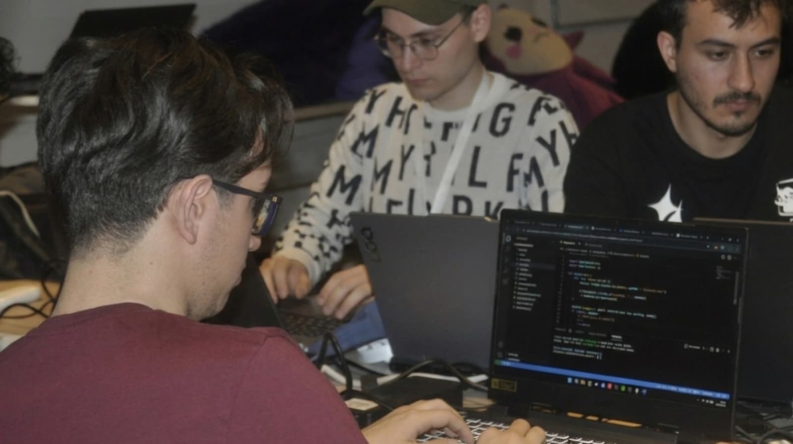

Geçtiğimiz günlerde BuilderMare ve Monad tarafından düzenlenen **Blitz Kayseri** hackathonundaydım. Birinci sınıf bir bilgisayar mühendisliği öğrencisi olarak, bu etkinliğin benim için sadece bir kod yazma maratonu değil, gerçek bir vizyon genişlemesi olduğunu söyleyebilirim.

### Beklentilerin Ötesinde Bir Seviye
Etkinliğe katılırken kafamda belirli bir seviye tahmini vardı ancak katılımcılarla tanışınca çıtanın tahmin ettiğimden çok daha yukarıda olduğunu gördüm. Üst dönemlerden öğrencilerin ve blockchain ekosistemine hakim geliştiricilerin ortaya koyduğu projeleri izlemek, yolun henüz ne kadar başında olduğumu ve bu yolun ne kadar heyecan verici olduğunu bana gösterdi. Bu rekabeti görmek, kendi çıtamı nereye koymam gerektiğini net bir şekilde anlamamı sağladı.

### "En Zayıf Proje" ve En Güçlü Motivasyon
Etkinliğin belki de teknik açıdan en başlangıç seviyesi projesini yapmış olmanın gururunu yaşıyorum(!). Ancak bu durum benim için bir yenilgi değil; tam aksine bir motivasyon kaynağına dönüştü. Kendi eksiklerimi, öğrenmem gereken yolları ve global standartları bu kadar yakından görmeye ihtiyacım varmış. Bazen en aşağıda olduğunuzu görmek, tırmanmanız gereken zirveyi en net görebildiğiniz andır.

### LostChain: Kayıp Eşyalar Blockchain Altyapısıyla Takipte
Etkinlik süresince yaklaşık 6 saatlik bir çalışma ile **LostChain** projesini geliştirdim.

**Problem:** Kampüs içindeki kayıp eşya süreçlerinin manuel ilerlemesi, sahiplik kanıtının zorluğu ve takibin şeffaf olmaması.
**Çözüm:** Blockchain altyapısı kullanarak kayıp eşya bildirimlerini şeffaf, güvenli ve değiştirilemez bir sisteme taşımak.

LostChain ile amacım, kampüs içinde bulunan bir eşyanın bulunduğu andan sahibine teslim edildiği ana kadar olan süreci bir akıllı kontrat (smart contract) üzerinden takip etmekti. Henüz yolun başında bir MVP (Minimum Viable Product) olsa da, blockchain teknolojisinin günlük hayatın küçük problemlerine nasıl entegre edilebileceğini bu proje ile bizzat deneyimledim.

### Sonuç ve Gelecek Vizyonu
Bu süreç şimdiden bakış açımı değiştirdi. Bir dahaki sefere sadece orada bulunmak için değil, o yüksek çıtanın bir parçası olmak için çok daha güçlü döneceğim.

---

**🔗 Proje Linkleri:**
- [Canlı Uygulama](https://lost-chain-nextjs.vercel.app)
- [GitHub Repo](https://github.com/MuhammetTalhaDemir/LostChain)

