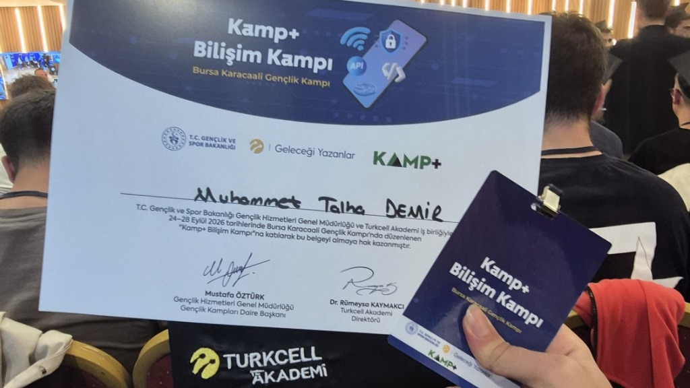

Geçtiğimiz günlerde Gençlik ve Spor Bakanlığı (GSB) ve Turkcell işbirliği ile düzenlenen **Bursa Karacaali Gençlik Kampı**'ndaydım. İkinci sınıf bir bilgisayar mühendisliği öğrencisi olarak, bu kampa giderken beklentilerim oldukça yüksekti; kapsamlı ve derinlemesine bir Android eğitim süreci yaşayacağımı düşünüyordum. Ancak süreç, planladığımdan biraz daha farklı ilerledi.

### Beklentiler, Krizler ve Network'ün Gücü

Eğitim süreci maalesef yeterli ön hazırlık yapılmadan kurgulanmıştı. İnternet bağlantısı problemleri, çalışma alanı sıkıntıları ve konuların yüzeysel geçilmesi başlangıçta heves kırıcı olabilirdi. Ancak kriz ortamları her zaman kendi fırsatlarını doğurur. Eğitim beklediğim derinlikte olmasa da, bu kamp bana harika bir network kattı. Benimle aynı yoldan yürüyen, aynı heyecanı paylaşan birçok bölümdaşımla tanıştım. Turkcell kültürünü yakından gözlemleme fırsatı buldum ve sektörden profesyonellerle ufuk açıcı sohbetler ettim. En önemlisi, o kamptan tam teşekküllü kendi mobil uygulamamı geliştirmiş olarak ayrıldım.

### Sıfır Noktasından AI Destekli Geliştirmeye

Mobil uygulama geliştirme konusunda daha önce hiçbir deneyimim yoktu. Kampta projeyi adım adım inşa etmemiz için "Checkpoint" (CP) mantığıyla ilerleyen bir yapı kurulmuştu. Fikir olarak harika olsa da, süreç içinde o adımların içini nasıl dolduracağımız pek anlatılmıyordu.

İşte tam bu noktada, eğitmenlerimizin de desteklediği modern bir yaklaşımı benimsedim: **Yapay Zeka ile omuz omuza çalışmak.** Android Studio üzerinden AI araçlarını kullanarak, eksik kalan teorik bilgileri pratiğe döktüm. Yapay zekayı bir "kod yazıcı" olarak değil, bir "mentor" olarak kullandım. Mimariyi kurgularken sorduğum sorular ve aldığım yönlendirmeler sayesinde öğrenme eğrim inanılmaz derecede hızlandı.

### Kampın Sınırlarını Aşmak: Karşınızda AirV

Eğitimin bizden istediği final projesi aslında belliydi: Ana ekranda şehir listesi ve anlık hava durumu, üstte arama çubuğu, ayrı bir ekranda favori şehirler ve seçilen şehrin detaylarına (nem, hissedilen sıcaklık, rüzgar, saatlik ve 7 günlük tahmin) ulaşılan standart bir yapı.

Ancak "sadece isteneni yapmak" benim tarzım değil. Projemin adını **AirV** koydum ve kampın belirlediği sınırların çok ötesine geçerek onu gerçek bir ürüne dönüştürdüm:

- **UI/UX Yenilikleri:** Şehir kartlarına sadece metin değil, animasyonlu hava durumu ikonları ekledim.
- **Kullanıcı Deneyimi:** Favori şehirleri ayrı ve uzak bir ekrana koymak yerine, ana ekranda arama çubuğu ile şehir kartları arasına şık bir çerçeve (frame) içinde sabitledim.
- **Performans Optimizasyonu:** Uygulamanın açılış hızını artırmak için API'den veri çekim süreçlerini optimize ettim, sadece ekranda gösterilecek verilerin asenkron olarak parse edilmesini sağladım.
- **Ekstra Özellikler:** Bağımsız bir Ayarlar (Settings) ekranı ve uygulamanın global standartlara yaklaşması için İngilizce dil desteği ekledim.

### Kaputun Altında Neler Var?

Hiç deneyimim olmayan bir alanda, güncel endüstri standartlarını kullanarak modern bir altyapı kurdum:

- **Jetpack Compose:** Geleneksel XML yerine, tamamen declarative (bildirimsel) UI tasarımı.
- **Clean Architecture & MVVM:** Veri çekme işlemleri ile kullanıcı arayüzünü birbirinden tamamen ayırarak sürdürülebilir bir kod tabanı.
- **Asenkron Veri Akışı:** Uygulamanın donmasını engelleyen Coroutines ve StateFlow yapıları.
- **Room Database:** Favori şehirlerin cihazda kalıcı olarak saklanması.

### Sonuç: Korkulan Dağları Aşmak

AirV projesi ve Bursa Karacaali kampı bana çok net bir şey öğretti: Gözümüzde büyüttüğümüz, "hiç deneyimim yok, yapamam" dediğimiz teknolojiler (bu benim için mobil geliştirmeydi) aslında içine girildiğinde o kadar da korkutucu değilmiş. Doğru araçları kullanmayı bildiğinizde ve mimariyi doğru kurguladığınızda ortaya çıkan ürün, verdiğiniz emeğe fazlasıyla değiyor.

Şimdi önümde çok daha net bir vizyon var. İleride kendi hikayemi anlatan o indie oyunu geliştirirken veya yepyeni projeler üretirken, bu kampta edindiğim "çözüm odaklı" bakış açısını kullanacağım.

---

**🔗 Proje Linkleri:**
- [GitHub Repo](https://github.com/MuhammetTalhaDemir/Weather-App)
- [APK İndir](https://github.com/MuhammetTalhaDemir/Weather-App/releases/download/v1.0.0/app-release.apk)

