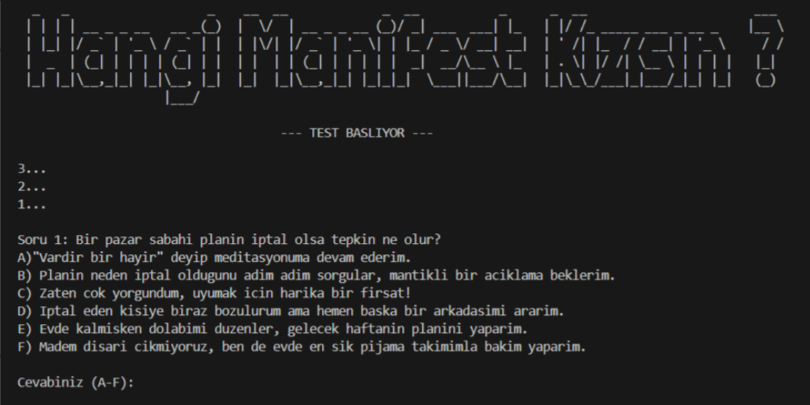

v0.5 Güncellemesiyle projenin çehresini değiştiren birkaç dokunuş yaptım.
C dilinin temellerini öğrenirken sıra **Recursion** (Özyineleme) konusuna geldi. Ben de bunu sadece teoride bırakmayıp projeme dahil etmek istedim. Sonuç? Daha akıcı, daha profesyonel ve kesinlikle daha keyifli bir test oldu.

### Neler Ekledim?

- **Recursive Countdown:** Test başlamadan önce ve sonuçlar hesaplanırken o "Acaba ne çıkacak?" heyecanını yaşatmak için özyinelemeli bir geri sayım mekanizması entegre ettim.
    
- **Sleep (Zamanlama):** Programın her şeyi bir saniyede ekrana kusması yerine, `Sleep` ile aralara birer saniye nefes payı koydum. Bu sayede test artık kullanıcıyı boğmadan, tane tane ilerliyor.
    
- **Buffer Cleaner (Küçük Bir Mühendislik Hilesi):** Projede can sıkan bir Input Buffer problemi vardı. Henüz **Stream Handling** konusuna gelmediğim için bu sorunu `getchar();` ile şimdilik çözdüm.
    
- **Splash Screen:** Testin girişine, kullanıcıyı ilk saniyeden havaya sokacak devasa bir **ASCII Art** ekledim.
    

Bu versiyon benim için bir dönüm noktası oldu. Bir sonraki hedefim; o kalabalık değişkenleri bir kenara bırakıp **Diziler (Arrays)** ile kodun mimarisini baştan aşağı modernize etmek.

📝 **Not:** Bu projenin ne olduğunu, nasıl başladığını ve teknik detaylarını merak ediyorsanız, serinin ilk yazısına [buradan](https://muhammettalhademir.com/blog/hangi-manifest-kizisin-testi/) ulaşabilirsiniz.

👉 [GitHub Repo](https://github.com/MuhammetTalhaDemir/HangiManifestKizisinTesti)

